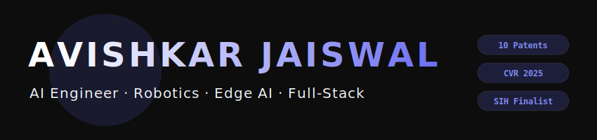

  

  

I engineer autonomous navigation stacks, on-device perception models, and multi-physics LLM platforms across the hardware-software boundary. By deploying `VINS-Fusion` visual-inertial pipelines on NVIDIA Jetson architectures and quantizing complex computer vision networks for real-time inference on edge microcontrollers, I specialize in systems that maintain high availability under severe compute constraints. My technical work includes 10 published utility patents, an accepted paper at CVR 2025, and high-performance showings at the SIH 2025 National Finals, Tata Elxsi Top 60, and LTTS TECHgium Top 7. Ultimately, my focus remains rooted in designing production-ready systems that function reliably when exposed to real-world hardware limitations and latency requirements.

<table>
<tr>
<td width="33%" valign="top">
<h4 align="center">🤖 Robotics & Perception</h4>
<ul>
<li>VIO pipelines & state estimation</li>
<li>ROS2 driver architecture</li>
<li>EKF sensor fusion</li>
<li>SLAM & loop closure detection</li>
<li>Edge deployment on Jetson/RPi</li>
</ul>
</td>
<td width="33%" valign="top">
<h4 align="center">🧠 AI & LLM Systems</h4>
<ul>
<li>LLM requirement parsing & RAG</li>
<li>Agentic workflows & pipelines</li>
<li>Surrogate ML modeling</li>
<li>Multi-physics simulation</li>
<li>Groq streaming inference</li>
</ul>
</td>
<td width="33%" valign="top">
<h4 align="center">🌐 Full-Stack & Systems</h4>
<ul>
<li>React 19 / Next.js 14</li>
<li>FastAPI & Node.js backends</li>
<li>Docker containerization</li>
<li>Real-time streaming APIs</li>
<li>3D web rendering via WebGL</li>
</ul>
</td>
</tr>
</table>

 

 

 

 

<table>
<tr>
<td valign="top">

</td>
<td valign="top">

</td>
</tr>
</table>

 

<table>
<tr>
<td width="50%" valign="top">
<h4 align="center">Building</h4>
<ul>
<li>GPS-denied autonomous navigation systems</li>
<li>On-device assistive AI at the edge</li>
<li>LLM-powered engineering automation pipelines</li>
</ul>
</td>
<td width="50%" valign="top">
<h4 align="center">Learning</h4>
<ul>
<li>MAVLink / PX4 integration for autonomous UAVs</li>
<li>ONNX model export for cross-platform edge deployment</li>
<li>WebSocket-based real-time simulation streaming</li>
</ul>
</td>
</tr>
</table>

 

